##  Hi, I'm Maria Clara Sanchez!

### Backend Software Engineer @ CI&T · MSc student in Computer Science (ICMC/USP)

Computer Engineer with 4+ years of experience building backend systems, REST APIs and integrations, mostly with **Python**. I currently work on business-critical applications for a client in the financial sector.

- 🔭 Working on backend services, microservices and production support in the financial sector
- 🎓 Master's student in **Distributed Systems & Concurrent Programming** at ICMC/USP
- 🌱 Interested in cloud-native apps, **Kubernetes**, autoscaling and software architecture
- 🧹 I care about Clean Code, Clean Architecture, SOLID and good tests
- 📍 Poços de Caldas, MG, Brazil 

  

## 💻 Tech Stack

  
  
  
  
  
  
  
  
  
  
  
  

 

**Also:** Snowflake · CI/CD · Microservices · Hexagonal Architecture · Design Patterns · Mutation & Integration Testing

## 📊 GitHub Stats

  
  

  

## 🥳 Connect with me

  <!-- TODO: troque PORTFOLIO_URL pelo link do seu site no Netlify -->
  
  
  
  

 

